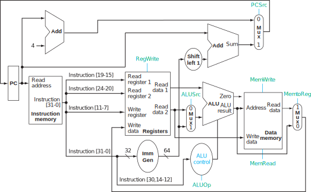

# DINO CPU Assignment 1

Originally from ECS 154B Lab 1, Winter 2019.
Modified for ECS 154B Lab 1, Spring 2020.

# Table of Contents

* [Introduction](#introduction)
  * [Goals](#goals)
  * [Tools](#tools)
      * [Using the CSIF machines](#using-the-csif-machines)
* [Part I: Implement the ALU Control](#part-i-implement-the-alu-control)
      * [Testing your ALU control unit](#testing-your-alu-control-unit)
* [Part II: Draw a diagram for implementing R-type instructions](#part-ii-draw-a-diagram-for-implementing-r-type-instructions)
* [Part III: Implement the ADD instruction](#part-iii-implement-the-add-instruction)
  * [Testing your ADD instruction](#testing-your-add-instruction)
* [Part IV: Implementing the rest of the R-type instructions](#part-iv-implementing-the-rest-of-the-r-type-instructions)
  * [Testing the rest of the instructions](#testing-the-rest-of-the-instructions)
* [Part V: Moving on to multiple cycles](#part-v-moving-on-to-multiple-cycles)
  * [Testing](#testing)
* [Grading](#grading)
* [Submission](#submission)
  * [Code portion](#code-portion)
  * [Academic misconduct reminder](#academic-misconduct-reminder)
* [Hints](#hints)
  * [Printf debugging](#printf-debugging)


# Introduction


In this assignment you will start implementing the DINO CPU (Davis IN-Order CPU).
This is a simple in-order CPU design based closely on the CPU model in Patterson and Hennessey's Computer Organization and Design.
Before starting on the CPU, we will give you a brief tour of [Chisel](https://chisel.eecs.berkeley.edu/), the language that we will be using to describe the hardware that implements the CPU.

Through this course, we will be building this CPU from the ground up.
You will be provided with some template code which contains a set of interfaces between CPU components and some pre-written components.
You will combine these components together into a working processor!

You can check out the tag `lab1-sq20` to get the template code for this lab.

## Goals

- Learn how to use Chisel
- Learn how to run tests and debug Chisel
- Start implementing a RISC-V CPU!

## Tools

The first step is to familiarize yourself with the tools that we'll be using in this course.

[Chisel](https://chisel.eecs.berkeley.edu/) is an open-source hardware construction language, developed at UC Berkeley.
You write Scala code, which is syntactically similar to Java.
Chisel can then generate low-level Verilog code, which is a hardware description language used by a variety of tools to describe how an electronic circuit works.

There is a more detailed Chisel overview found under the [Chisel notes directory](../documentation/chisel-notes/overview.md).
Before diving into this assignment, you are encouraged to go through the [Chisel notes](../documentation/chisel-notes/overview.md).
You can find additional help and documentation on [Chisel's website](https://chisel.eecs.berkeley.edu/).

Details on how to set up your development environment using Chisel and Singularity can be found in the [Singularity document](../documentation/singularity.md).

### Using the CSIF machines

Singularity is installed on the CSIF machines.
So, if you are using one of the CSIF machines either locally or remotely, things should *just work*.
However, if you run into any problems, post on Campuswire or come to office hours.

The images are relatively large files.
As of the beginning of the quarter, the image is 380 MB.
We have tried to keep the size as small as possible.
Thus, especially if we update the image throughout the quarter, you may find that the disk space on your CSIF account is full.
If this happens, you can remove the Singularity cache to free up space.

To remove the Singularity cache, you can run the following command.

```
rm -r ~/.singularity/cache
```

To find out how much space the Singularity containers are using, you can use `du` (disk usage):

```
du -sh ~/.singularity/cache
```

You can also download the images to `/tmp`, if you do not have space in your user directory.
One way to do this is to create a symlink from `.singularity/cache` to a directory in `/tmp`.
As an example

```
mkdir /tmp/jlp
mkdir /tmp/jlp/singularitycache
ln -s ~/.singularity/cache /tmp/jlp/singularitycache
```

Let us know if you would like more details on this method via Campuswire.

# Part I: Implement the ALU Control

**The test for this part is `dinocpu.ALUControlTesterLab1`.**

In this part you will be implementing a component in the CPU design.

The ALU has already been implemented for you.
It takes three inputs: the `operation`, and two inputs, `inputx` and `inputy`.
It generates the `result` of the operation on the two inputs.

The following table details the `operation` input and which values produce which results.

|      |      |
|------|------|
| 0000 | and  |
| 0001 | or   |
| 0010 | add  |
| 0011 | sub  |
| 0100 | sra  |
| 0101 | sltu |
| 0110 | xor  |
| 0111 | srl  |
| 1000 | slt  |
| 1001 | sll  |

You must take the RISC-V ISA specification and implement the proper control to choose the right ALU operation.
You can find the specification in the following places:

- the first page of the Computer Organization and Design book
- on page 16 in the RISC-V reader
- [on the RISC-V website](https://riscv.org/specifications/)

| 31--25  | 24--20 | 19--15 | 14--12 | 11--7 | 6--0      |        |
|---------|--------|--------|--------|-------|-----------|--------|
| funct7  | rs2    | rs1    | funct3 | rd    | opcode    | R-type |
| ------- | ------ | ------ | ------ | ----- | --------- | -----  |
| 0000000 | rs2    | rs1    | 000    | rd    | 0110011   | ADD    |
| 0100000 | rs2    | rs1    | 000    | rd    | 0110011   | SUB    |
| 0000000 | rs2    | rs1    | 001    | rd    | 0110011   | SLL    |
| 0000000 | rs2    | rs1    | 010    | rd    | 0110011   | SLT    |
| 0000000 | rs2    | rs1    | 011    | rd    | 0110011   | SLTU   |
| 0000000 | rs2    | rs1    | 100    | rd    | 0110011   | XOR    |
| 0000000 | rs2    | rs1    | 101    | rd    | 0110011   | SRL    |
| 0100000 | rs2    | rs1    | 101    | rd    | 0110011   | SRA    |
| 0000000 | rs2    | rs1    | 110    | rd    | 0110011   | OR     |
| 0000000 | rs2    | rs1    | 111    | rd    | 0110011   | AND    |

This table is from the RISC-V User-level ISA Specification v2.2, page 104.
You can find the same information in Chapter 2 of the Specification, Chapter 2 of the RISC-V reader, or in the front of the Computer Organization and Design book.

The ALU control takes four inputs:
- `aluop` and `itype`, which come from the control unit (you will implement this in the next lab)
- `funct7` and `funct3`, which come from the instruction

You can ignore the `aluop` and `itype` for now.
Assume both are always `0`.

Given these inputs, you must generate the correct output on the operation wire.
The template code from `src/main/scala/components/alucontrol.scala` is shown below.
You will fill in where it says *Your code goes here*.

```
/**
 * The ALU control unit
 *
 * Input:  add, if true, add no matter what the other bits are
 * Input:  immediate, if true, ignore funct7 when computing the operation
 * Input:  funct7, the most significant bits of the instruction
 * Input:  funct3, the middle three bits of the instruction (12-14)
 * Output: operation, What we want the ALU to do.
 *
 * For more information, see Section 4.4 and A.5 of Patterson and Hennessy
 * This follows figure 4.12
 */
class ALUControl extends Module {
  val io = IO(new Bundle {
    val aluop     = Input(UInt(2.W))
    val itype     = Input(Bool())
    val funct7    = Input(UInt(7.W))
    val funct3    = Input(UInt(3.W))

    val operation = Output(UInt(4.W))
  })

  io.operation := "b1111".U // invalid operation

  // Your code goes here
}
```

**HINT:** Use Chisel's  `when` / `elsewhen` / `otherwise`, or `MuxCase` syntax.
See [the Chisel getting started guide](../documentation/chisel-notes/getting-started.md) for examples.
You may also find the [Chisel cheat sheet](https://www.chisel-lang.org/doc/chisel-cheatsheet3.pdf) helpful.

### Testing your ALU control unit

We have implemented some tests for your ALU control unit.
The general ALU control unit tests are in `src/test/scala/components/ALUControlUnitTest.scala`.
However, these tests require you to implement the required control for not only the R-type instructions but also for I-Types and loads/stores.
Thus, there are Lab 1-specific tests in `src/test/scala/labs/Lab1Test.scala`.

To run these tests, you simply need to execute the following at the sbt command prompt:

```
dinocpu:sbt> test
```

If you try this before you implement your ALU control unit, you'll see something like the following:

```
sbt:dinocpu> test
[info] [0.002] Elaborating design...
[info] [0.002] Elaborating design...
[info] [0.002] Elaborating design...
[info] [0.002] Elaborating design...
[info] [0.002] Elaborating design...
[info] [0.156] Done elaborating.
WARNING: No file will be loaded for data memory
WARNING: No file will be loaded for data memory
WARNING: No file will be loaded for data memory
CPU Type: single-cycle
Branch predictor: always-not-taken
Memory file: test_run_dir/single-cycle/or/or.hex
Memory type: combinational
Memory port type: combinational-port
Memory latency (ignored if combinational): 0
CPU Type: single-cycle
Branch predictor: always-not-taken
Memory file: test_run_dir/single-cycle/add2/add2.hex
Memory type: combinational
Memory port type: combinational-port
Memory latency (ignored if combinational): 0
CPU Type: single-cycle
Branch predictor: always-not-taken
Memory file: test_run_dir/single-cycle/add0/add0.hex
Memory type: combinational
Memory port type: combinational-port
Memory latency (ignored if combinational): 0
CPU Type: single-cycle
Branch predictor: always-not-taken
Memory file: test_run_dir/single-cycle/addfwd/addfwd.hex
Memory type: combinational
Memory port type: combinational-port
Memory latency (ignored if combinational): 0
[info] [0.947] Done elaborating.
[info] [0.947] Done elaborating.
[info] [0.947] Done elaborating.
[info] [0.950] Done elaborating.
Total FIRRTL Compile Time: 878.1 ms
Total FIRRTL Compile Time: 46.0 ms
End of dependency graph
Circuit state created
[info] [0.002] SEED 1585495922699
[info] [0.014] EXPECT AT 1 load/store wrong  io_operation got 15 expected 2 FAIL
[info] [0.015] EXPECT AT 2 load/store wrong  io_operation got 15 expected 2 FAIL
[info] [0.016] EXPECT AT 3 load/store wrong  io_operation got 15 expected 2 FAIL
[info] [0.018] EXPECT AT 4 add wrong  io_operation got 15 expected 2 FAIL
...
```

This output continues for a while and somewhere in it you'll see that all of the tests failed.

```
[info] Run completed in 20 seconds, 71 milliseconds.
[info] Total number of tests run: 23
[info] Suites: completed 5, aborted 0
[info] Tests: succeeded 5, failed 18, canceled 0, ignored 0, pending 0
[info] *** 18 TESTS FAILED ***
[error] Failed: Total 23, Failed 18, Errors 0, Passed 5
[error] Failed tests:
[error] 	dinocpu.SingleCycleRTypeTesterLab1
[error] 	dinocpu.SingleCycleAddTesterLab1
[error] 	dinocpu.ALUControlTesterLab1
[error] 	dinocpu.SingleCycleMultiCycleTesterLab1
[error] (test) sbt.TestsFailedException: Tests unsuccessful
```

Some of the failures will look scary.
This is expected.
As given, the template code causes compile errors in the tests.
This is because no registers are connected to input or output, so the compiler optimizes them away!
This confuses the simulator since it is trying to compare register values.
Once you have implemented your ALU control unit, these errors will go away.

In this part of the assignment, you only need to run the ALU control unit tests.
To run just these tests, you can use the sbt command `testOnly`, as demonstrated below.

```
dinocpu:sbt> testOnly dinocpu.ALUControlTesterLab1
```

Feel free to add your own tests in `src/tests/scala`, modify the current tests, and add `print` statements in the tests.

# Part II: Draw a diagram for implementing R-type instructions

For the rest of the assignments, you will implement all of RISC-V's R-type instructions.
Since you have implemented the ALU control, there isn't much more to do except to connect the correct wires together.
However, before you start writing code, you should know what you're going to do!
The goal of this part of the assignment is to allow you to design your hardware before you start trying to describe your design in Chisel.

To get an idea of how you are going to implement this, it's a good idea to first draw your design on a piece of paper.
It's such a good idea that we're going to make it mandatory, and you'll need to turn it in as part of your assignment.
We've provided you with a [blank circuit diagram](./assignment-1-worksheet.pdf).
Draw all of the wires and label which bits are on each wire.

We will be grading this diagram and looking for the following things:
- The correct wires.
- Every wire should contain its width in bits.
- For wires that are a subset of all of the bits, label which bits are on the wire.

Figure 4.15 from Computer Organization and Design below is an example of what we are looking for.
Notice how the instruction wire is broken into is sub-components.



**Important**: The book shows the answer for 64-bit RISC-V (rv64i) and a slightly different CPU design.
We are creating a 32-bit RISC-V CPU (rv32i).
The book will not contain the *exact* answers to the labs, though it will be very useful.
The above diagram shows the required hardware to implement a very small subset of the RISC-V instructions (a few R-type, lw, sw, and beq).
For this assignment, you only need to add the hardware to implement the R-type instructions.

**Hint**: **You may not need to use all of the modules provided.**
You only need to implement the *R-type* instructions, not all RISC-V instructions, on this lab assignment.

**Hint 2**: The control unit as provided is *completely empty* and has `false` or 0 on every output.
*You do not need to use the control unit for this assignment!*

# Part III: Implement the ADD instruction

**The test for this part is `dinocpu.SingleCycleAddTesterLab1`.**

Now you're ready to implement your first instruction!
For this part of the assignment, you will modify the `src/main/scala/single-cycle/cpu.scala` file.
You are beginning to implement the DINO CPU!

In the `src/main/scala/single-cycle/cpu.scala` file, you will find all of the components that are shown on the [blank circuit diagram](./assignment-1-worksheet.pdf).
The components are all instantiated Chisel `Module`s.

Notice that in the template code all of the IO for each module is set to `DontCare`.
This allows the Chisel code to compile, but it also means these modules are optimized away when generating the hardware.
You will be removing the `:= DontCare` as you hook up the modules in this part of the assignment.

We have given you the one part of the answer:

```
io.imem.address := pc
```

This creates a wire from the PC to the instruction memory.


You should fill in the other wires (and instruction subsets) that are required to implement the `add` RISC-V instruction.
We will be talking in detail about RISC-V instructions and how to design a RISC-V processor during the second week's lectures, as shown on the [schedule](https://github.com/jlpteaching/ECS154B/blob/master/syllabus/schedule.csv).

**Important**: You will not need to modify anything below the `Object to make it easier to print information about the CPU` line.
This code should be kept the same for everyone.

You may add debug code, as you are working on the assignment.
However, when you turn in your assignment, please comment out or remove your debug code before submitting.

## Testing your ADD instruction

Testing the CPU is very similar to testing your control unit [above](#testing-your-alu-control-unit).
To run the tests, you execute the `SingleCycleCPUTesterLab1` suite as follows.

```
dinocpu:sbt> testOnly dinocpu.SingleCycleAddTesterLab1
```

This runs a very simple RISC-V application that has a single instruction: `add`.
You can find the code for this program in `src/test/resources/risc-v/add1.riscv` and below:

```
  .text
  .align 2       # Make sure we're aligned to 4 bytes
  .globl _start
_start:
    add t1, zero, t0 # (reg[6] = 0 + reg[5])

    nop
    nop
    nop
    nop
    nop
_last:
```

(There are a number of `nop` instructions at the end for testing the pipelined CPU in Lab 3.
You can ignore them for now.)

When you get the correct answer, you should see the following output.

```
sbt:dinocpu> testOnly dinocpu.SingleCycleAddTesterLab1
[info] [0.001] Elaborating design...
[info] [0.420] Done elaborating.
Total FIRRTL Compile Time: 1268.4 ms
file loaded in 0.177122564 seconds, 548 symbols, 531 statements
[info] SingleCycleAddTesterLab1:
[info] Single Cycle CPU
[info] - should run add test add1
[info] ScalaTest
[info] Run completed in 3 seconds, 897 milliseconds.
[info] Total number of tests run: 1
[info] Suites: completed 1, aborted 0
[info] Tests: succeeded 1, failed 0, canceled 0, ignored 0, pending 0
[info] All tests passed.
[info] Passed: Total 1, Failed 0, Errors 0, Passed 1
[success] Total time: 6 s, completed Jan 8, 2020 1:26:31 AM
```

The test only runs for a single cycle, since you're just executing one instruction.

Note that the test initializes `t0` to 1234.
You can see this on line 70 in `src/test/scala/labs/Lab1Test.scala`.
This creates a `CPUTestCase` that:
- runs the `add1` program
- uses the `single-cycle` CPU
- initializes the `t0` register to 1234
- checks that `zero` is 0, `t0` is 1234, and `t1` is 1234
- doesn't initialize any memory addresses
- doesn't check any memory addresses

More information about `CPUTestCase` can be found in the code (`src/test/scala/cpu-tests/CPUTesterDriver.scala`, line 94), and in the [DINO CPU documentation](../documentation/testing.md).

You can also use the [single stepper](../documentation/single-stepping.md) to step through the execution one cycle at a time and print information as you go.
Details on how to use the single stepper can be found in the [documentation](../documentation/single-stepping.md).
An example on how to use it is shown below.

First, you can start the single stepper program:

```
runMain dinocpu.singlestep add1 single-cycle
```

This will compile the `single-cycle` CPU design (which is what you're currently working on) and run the application/test `add1` on that CPU design.

After you start the program, you'll see a command prompt:

```
Single stepper>
```

Here, you can print registers, dump I/O for modules, and step the processor through multiple cycles.

For instance, if you have the correct design, you should see the following:

```
Single stepper> dump registers
registers.io.readdata1         0 (0x0)
registers.io.readdata2         1234 (0x4d2)
registers.io.readreg1          0 (0x0)
registers.io.writereg          6 (0x6)
registers.io.readreg2          5 (0x5)
registers.io.writedata         1234 (0x4d2)
registers.io.wen               1 (0x1)
```

This is saying that you're reading registers 1 and 5, the value in register 1 is 0, the value in register 5 is 1234, you're writing register 6, the value you're writing is 1234, and you're asserting `wen`.

Similarly, the ALU wires should look like the follwing:

```
Single stepper> dump alu
alu.io.inputx                  0 (0x0)
alu.io.result                  1234 (0x4d2)
alu.io.inputy                  1234 (0x4d2)
alu.io.operation               2 (0x2)
```

Finally, you can also dump the value of specific registers.
`t0` is register 5 (see page 19 of the RISC-V reader) and `t1` is register 6.
So, let's print these two register at cycle 0, step one cycle, then print them at cycle 1.

```
Single stepper> print reg 5
reg5: 1234
Single stepper> print reg 6
reg6: 0
Single stepper> step 1
Single stepper> print reg 5
reg5: 1234
Single stepper> print reg 6
reg6: 1234
```

On cycle 1, register 6 is written with 1234, as it should be!

More details on how to use the single stepper can be found in the [documentation](../documentation/single-stepping.md).
You can also write `?` on the command prompt to see the help.


# Part IV: Implementing the rest of the R-type instructions

**The test for this part is `dinocpu.SingleCycleRTypeTesterLab1`.**

In this part of the lab, you will be implementing all of the other R-type RISC-V instructions.
These are all of the ALU operations in the ISA.
For each of the operations, we have included a test program that has only that one instruction.

If you have passed the `AddTest` test and you passed the `ALUControlTest`, then all of the other R-type instruction should *just work*!
Now, test them to make sure that they do!

You may need to update the wires in your CPU design to get all of the R-type instructions to work.
There are a couple of tricky ones that may cause you to re-think your design.

- `add0` tests to make sure you don't overwrite register 0 (it should always be 0 in RISC-V).
- The `sub` and `sra` instructions will stress corner cases in your ALU control unit, but you already passed those tests so it should work!
- The signed and unsigned versions of instructions are also tricky.

## Testing the rest of the instructions

Testing the CPU is very similar to testing your control unit [above](#testing-your-alu-control-unit).
To run the tests, you execute the `SingleCycleRTypeTesterLab1` suite as follows:

```
dinocpu:sbt> testOnly dinocpu.SingleCycleRTypeTesterLab1
```

This will load some binary applications from `src/test/resources/risc-v`.
The applications that it is running is specified in the output.
Below is an example of a test that failed:

```
[info] SingleCycleCPUTesterLab1:
[info] Single Cycle CPU
[info] - should run rtype add1 *** FAILED ***
...
```

This ran an **rtype** application which used the binary **add1**.
You can view the RISC-V assembly for this application in `src/test/resources/risc-v/add1.riscv`.
The list of applications that this suite will run can be found in the `InstTests.scala` file (`src/test/scala/cpu-tests/InstTests.scala`).
If you want more details on the syntax and how to extend this to other RISC-V binaries, ask on Campuswire and we will be happy to expand this section.

If you want to run only a single application from this suite of tests, you can add a parameter to the `test` sbt task.
You can pass the option `-z` which will execute any tests that match the text given to the parameter.
You must use `--` between the parameters to the sbt task (e.g., the suite to run) and the parameters for testing.
For instance, to only run the subtract test, you would use the following:

```
sbt> testOnly dinocpu.SingleCycleRTypeTesterLab1 -- -z sub
```

Remember, you can also use the `singlestep` application to inspect wires and registers or use Chisel's debug printing.

# Part V: Moving on to multiple cycles

**The test for this part is `dinocpu.SingleCycleMultiCycleTesterLab1`.**

Now, let's try a more complicated program that executes more that one instruction.
`addfwd` is one example of this which executes 10 add instructions in a row.

There is only one minor change from [Part IV](#part-iv-implementing-the-rest-of-the-r-type-instructions) to get these programs to execute correctly.
These programs are starting to be able to do some "real" things.
For instance, `power2` computes whether the input register is a power of 2.

```
  .text
  .align 2       # Make sure we're aligned to 4 bytes
  .globl _start
_start: #checks if v is a power of 2
	#stores 1 in f if true or 0 if false
	#  t0 =v and t2 = f and t1 = 1
    sub t2, t0, t1  # t2 = v - 1
    and t2, t0, t2  # t2 = v & (v-1)
    sltu t2,t2,t1   # f = (t2 <1)
    nop
    nop
    nop
    nop
    nop
_last:
```

## Testing

To run just one test, you can use the `-z` trick from above.

```
dinocpu:sbt> testOnly dinocpu.SingleCycleMultiCycleTesterLab1 -- -z addfwd
```

# Grading

Grading will be done automatically on Gradescope.
See [the Submission section](#Submission) for more information on how to submit to Gradescope.

|                    |     |
|--------------------|-----|
| ALU control        | 30% |
| Diagram            | 30% |
| Add 0 Case         |  5% |
| Other Add Cases    | 10% |
| Other instructions | 15% |
| Multiple cycles    | 10% |

# Submission

**Warning**: read the submission instructions carefully.
Failure to adhere to the instructions will result in a loss of points.

## Code portion

You will upload the two files that you changed to Gradescope on the [Lab 1]() assignment.

- `src/main/scala/components/alucontrol.scala`
- `src/main/scala/single-cycle/cpu.scala`

Once uploaded, Gradescope will automatically download and run your code.
This should take less than 5 minutes.
For each part of the assignment, you will receive a grade.
If all of your tests are passing locally, they should also pass on Gradescope unless you made changes to the I/O, **which you are not allowed to do**.

Note: There is no partial credit on Gradescope.
Each part is all or nothing.
Either the test passes or it fails.

## Academic misconduct reminder

You are to work on this project **individually**.
You may discuss *high level concepts* with one another (e.g., talking about the diagram), but all work must be completed on your own.

**Remember, DO NOT POST YOUR CODE PUBLICLY ON GITHUB!**
Any code found on GitHub that is not the base template you are given will be reported to SJA.
If you want to sidestep this problem entirely, don't create a public fork and instead create a private repository to store your work.
GitHub now allows everybody to create unlimited private repositories for up to three collaborators, and you shouldn't have *any* collaborators for your code in this class.

# Hints

- Start early! There is a steep learning curve for Chisel, so start early and ask questions on Campuswire and in discussion.
- If you need help, come to office hours for the TAs, or post your questions on Campuswire.
- See [common errors](../documentation/common-errors.md) for some common errors and their solutions.

## Printf debugging

This is the best style of debugging for this assignment.

- Use printf when you want to print *during the simulation*.
  - Note: this will print *at the end of the cycle* so you'll see the values on the wires after the cycle has passed.
  - Use `printf(p"This is my text with a $var\n")` to print Chisel variables. Notice the "p" before the quote!
  - You can also put any Scala statement in the print statement (e.g., `printf(p"Output: ${io.output})`).
  - Use `println` to print during compilation in the Chisel code or during test execution in the test code. This is mostly like Java's `println`.
  - If you want to use Scala variables in the print statement, prepend the statement with an 's'. For example, `println(s"This is my cool variable: $variable")` or `println(s"Some math: 5 + 5 = ${5+5}")`.
