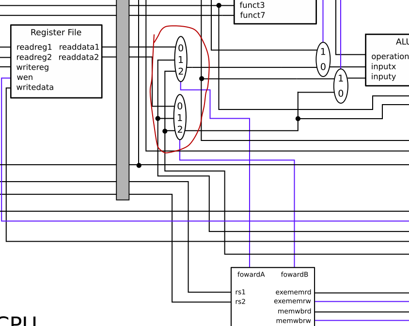

# DINO CPU Assignment 3

Originally from ECS 154B Lab 3, Winter 2019.
Modified for ECS 154B Lab 1, Spring 2020.

# Table of Contents

* [Introduction](#introduction)
    * [Updating the DINO CPU code](#updating-the-dino-cpu-code)
    * [How this assignment is written](#how-this-assignment-is-written)
    * [I/O constraint](#io-constraint)
    * [Goals](#goals)
* [Pipelined CPU design](#pipelined-cpu-design)
    * [Testing your pipelined CPU](#testing-your-pipelined-cpu)
    * [Debugging your pipelined CPU](#debugging-your-pipelined-cpu)
* [Part I: Re-implement the CPU logic and add pipeline registers](#part-i-re-implement-the-cpu-logic-and-add-pipeline-registers)
    * [Testing your basic pipeline](#testing-your-basic-pipeline)
* [Part II: Implementing forwarding](#part-ii-implementing-forwarding)
    * [Testing your forwarding unit](#testing-your-forwarding-unit)
* [Part III: Implementing branching and flushing](#part-iii-implementing-branching-and-flushing)
    * [Testing branching and flushing](#testing-branching-and-flushing)
* [Part IV: Hazard detection](#part-iv-hazard-detection)
    * [Testing your hazard detection unit](#testing-your-hazard-detection-unit)
* [Grading](#grading)
* [Submission](#submission)
    * [Code portion](#code-portion)
    * [Academic misconduct reminder](#academic-misconduct-reminder)
    * [Checklist](#checklist)
* [Hints](#hints)

# Introduction


In the last assignment, you implemented a full single cycle RISC-V CPU.
In this assignment, you will be extending this design to be a 5 stage pipeline instead of a single cycle.
You will also be implementing full forwarding for ALU instructions and hazard detection.
The simple in-order CPU design is based closely on the CPU model in Patterson and Hennessey's Computer Organization and Design.

## Updating the DINO CPU code

The DINO CPU code must be updated before you can run each lab.
You should read up on [how to update your code](../documentation/updating-from-git.md) to get the assignment 3 template from GitHub.

You can check out the master branch to get the template code for this lab.
If you want to use your solution from lab1 as a starting point, you can merge your commits with the `origin` master by running `git pull` or `git fetch; git merge origin/master`.

## How this assignment is written

The goal of this assignment is to implement a pipelined RISC-V CPU which can execute all of the RISC-V integer instructions.
Like the previous assignment, you will be implementing this step by step starting with a simple pipeline in [Part 1](#part-i-re-implement-the-cpu-logic-and-add-pipeline-registers).
After that, you will add to your design to implement forwarding and hazard detection.

## I/O constraint

We are making one major constraint on how you are implementing your CPU.
**You may not modify the I/O for any module.**
This is the same constraint that you had in Lab 2.
We will be testing your data path, your hazard detection unit, and our forwarding unit in isolation.
Therefore, you **must keep the exact same I/O**.
You will get errors on Gradescope (and thus no credit) if you modify the I/O.

## Goals

- Learn how to implement a pipelined CPU.
- Learn what information must be stored in pipeline registers.
- Learn which combinations of instructions cause hazards, and which can be overcome with forwarding.

# Pipelined CPU design

Below is a diagram of the pipelined DINO CPU.
This diagram includes all control wires unlike the diagram in [Assignment 2](assignment-2.md) in addition to all of the MUXes needed.

The pipelined design is based very closely on the single cycle design.
You may notice there are a few minor changes (e.g., the location of the PC MUX).
You can take your code from the [Assignment 2](assignment-2.md) as a starting point, or you can use the code provided in `src/main/scala/single-cycle/cpu.scala`, which is my solution to Assignment 2.


## Testing your pipelined CPU

Just like with the last lab, run the following command to go through all tests once you believe you're done.

```
sbt:dinocpu> test
```

You can also run the individual tests for each part with `testOnly`.
The command to run the tests for each part are included in each part below.

## Debugging your pipelined CPU

When you see something like the following output when running a test:

```
- should run branch bne-False *** FAILED ***
```

This means that the test `bne-False` failed.

For this assignment, it would be a good idea to single step through each one of the failed tests.
You can find out more information on this in the [DINO CPU documentation](../documentation/single-stepping.md).

You may also want to add your own `printf` statements to help you debug.
Details on how to do this were are in the [Chisel notes](../documentation/chisel-notes/printf-debugging.md).

# Part I: Re-implement the CPU logic and add pipeline registers

In this part, you will be implementing a full pipelined processor with the exception of forwarding and hazards.
After you finish this part, you should be able to correctly execute any *single instruction* application.

**This is the biggest part of this assignment, and is worth the most points.**
Unfortunately, there isn't an easy way to break this part down into smaller components.
I suggest working from left to right through the pipeline as shown in the diagram above.
We have already implemented the instruction fetch (IF) stage for you.

Each of the pipeline registers is defined as a `Bundle` at the top of the CPU definition.
For instance, the IF/ID register contains the `PC`, `PC+4`, and `instruction` as shown below.

```
  // Everything in the register between IF and ID stages
  class IFIDBundle extends Bundle {
    val instruction = UInt(32.W)
    val pc          = UInt(32.W)
    val pcplusfour  = UInt(32.W)
  }
```

We have also grouped the control into three different blocks to match the book.
These blocks are the `EXControl`, `MControl`, and `WBControl`.
We have given you the signals that are needed in the EX stage as an example of how to use these bundles.

```
  class EXControl extends Bundle {
    val itype        = Bool()
    val aluop        = UInt(2.W)
    val resultselect = UInt(2.W)
    val alusrc       = Bool()
    val pcadd        = Bool()
    val branch       = Bool()
    val jump         = Bool()
    val pcfromalu    = Bool()
  }
```

You can also create registers for the controls, and in the template we have split these out into other `StageReg`s.
We have given you the control registers.
However, each control register simply holds a set of bundles.
You have to set the correct signals in these bundles.

Note that to access the control signals, you may need an "extra" indirection.
See the example below:

```
class EXControl extends Bundle {
  val itype        = Bool()
  val aluop        = UInt(2.W)
  val resultselect = UInt(2.W)
  val alusrc       = Bool()
  val pcadd        = Bool()
  val branch       = Bool()
  val jump         = Bool()
  val pcfromalu    = Bool()
}

class IDEXControl extends Bundle {
  val ex_ctrl  = new EXControl
  val mem_ctrl = new MControl
  val wb_ctrl  = new WBControl
}

val id_ex_ctrl  = Module(new StageReg(new IDEXControl))
...

id_ex_ctrl.io.in.ex_ctrl.aluop     := control.io.aluop
```

Specifically in `id_ex_ctrl.io.in.ex_ctrl.aluop` you have to specify `ex_ctrl.aluop` since you are are getting a signal out of the `ex_ctrl` part of the `IDEXControl` bundle.

This pipeline register/bundle isn't complete.
It's missing *a lot* of important signals, which you'll need to add.

Again, I suggest working your way left to right through the pipeline.
For each stage, you can copy the datapath for that stage from the previous lab in `src/main/scala/single-cycle/cpu.scala`.
Then, you can add the required signals to drive the datapath to the register that feeds that stage.
Throughout the given template code in `src/main/scala/pipelined/cpu.scala`, we have given hints on where to find the datapath components from Lab 2.
We have also already instantiated each of the pipeline registers for you as shown below.

```
val if_id       = Module(new StageReg(new IFIDBundle))

val id_ex       = Module(new StageReg(new IDEXBundle))
val id_ex_ctrl  = Module(new StageReg(new IDEXControl))

val ex_mem      = Module(new StageReg(new EXMEMBundle))
val ex_mem_ctrl = Module(new StageReg(new EXMEMControl))

val mem_wb      = Module(new StageReg(new MEMWBBundle))
val mem_wb_ctrl = Module(new StageReg(new MEMWBControl))
```

For the `StageReg`, you have to specify whether the inputs are valid via the `valid` signal.
When this signal is high, this tells the register to write the values on the `in` lines to the register.
Similarly, there is a `flush` signal that when high will set all of the register values to `0` flushing the register.
In Part III, when implementing the hazard unit, you will have to wire these signals to the hazard detection unit.
For Part I, all of the registers (including the control registers) should always be `valid` and not `flush` as shown below.

```
if_id.io.valid := true.B
if_id.io.flush := false.B
```

For Part I, you **do not** need to use the hazard detection unit or the forwarding unit.
These will be used in later parts of the assignment.
You also do not need to add the forwarding MUXes or worry about the PC containing any value except `PC + 4`, for the same reason.

**Important**: Remember to remove the `*.io := DontCare` at the top of the `cpu.scala` file as you flesh out the I/O for each module.

## Testing your basic pipeline

You can run the tests for this part with the following commands:

```
sbt:dinocpu> testOnly dinocpu.RTypeTesterLab3
sbt:dinocpu> testOnly dinocpu.ITypeTesterLab3
sbt:dinocpu> testOnly dinocpu.UTypeTesterLab3
sbt:dinocpu> testOnly dinocpu.MemoryTesterLab3
```

Don't forget about [how to single-step through the pipelined CPU](https://github.com/jlpteaching/dinocpu/blob/master/documentation/single-stepping.md).

**Hint**: `auipc1` and `auipc3` actually execute two instructions (the first is a `nop`) so even though this section is about single instructions, you still need to think about the value of the `PC`.
Note: These instructions *don't* require forwarding.

# Part II: Implementing forwarding

There are three steps to implementing forwarding.

1. Add the forwarding MUXes to the execute stage, as seen below.
2. Wire the forwarding unit into the processor.
3. Implement the forwarding logic in the forwarding unit.



For #3, you may want to consult Section 4.7 of Patterson and Hennessy.
Specifically, Figure 4.53 will be helpful.
Think about the conditions you want to forward and what you want to forward under each condition.
`when/elsewhen/otherwise` statements will be useful here.

After this, you can remove the `forwarding.io := DontCare` from the top of the file.

## Testing your forwarding unit

With forwarding, you can now execute applications with multiple R-type and/or I-type instructions!
The following tests should now pass.

```
sbt:dinocpu> testOnly dinocpu.ITypeMultiCycleTesterLab3
sbt:dinocpu> testOnly dinocpu.RTypeMultiCycleTesterLab3
```

Don't forget about [how to single-step through the pipelined CPU](../documentation/single-stepping.md).

# Part III: Implementing branching and flushing

There are five steps to implementing branches and flushing.

1. Add MUXes for PC stall and PC from taken
2. Add code to bubble for ID/EX and EX/MEM
3. Add code to flush IF/ID
4. Connect the taken signal to the hazard detection unit
5. Add the logic to the hazard detection unit for when branches are taken.

Before you dive into this part, give some thought to what it means to bubble ID/EX and EX/MEM, how you will implement bubbles, and what it means to flush IF/ID.
Section 4.8 of Patterson and Hennessy will be helpful for understanding this part.

## Testing branching and flushing

With the branch part of the hazard detection unit implemented, you should now be able to execute branch and jump instructions!
The following tests should now pass.

```
sbt:dinocpu> testOnly dinocpu.BranchTesterLab3
sbt:dinocpu> testOnly dinocpu.JumpTesterLab3
```

Don't forget about [how to single-step through the pipelined CPU](../documentation/single-stepping.md)

# Part IV: Hazard detection

For the final part of the pipelined CPU, you need to detect hazards for certain combinations of instructions.
There are only three remaining steps!

1. Wire the rest of the hazard detection unit.
2. Modify the PC MUX.
3. Add code to *bubble* in IF/ID.

Again, section 4.8 of Patterson and Hennessy will be helpful here.

After this, you can remove the `hazard.io := DontCare`line from the top of the file.

## Testing your hazard detection unit

With the full hazard detection implemented, you should now be able to execute any RISC-V application!
The following tests should now pass.

```
sbt:dinocpu> testOnly dinocpu.MemoryMultiCycleTesterLab3
sbt:dinocpu> testOnly dinocpu.ApplicationsTesterLab3
```

Don't forget about [how to single-step through the pipelined CPU](../documentation/single-stepping.md).

## Full application traces

To make debugging easier, below are links to the full application traces from the solution to Lab 3.
To check your design, you can use the singlestep program.
If you run `print inst` at the prompt in the singlestep program it will print the current PC and the instruction at that PC (in the fetch stage).

- [Fibonacci](https://gist.github.com/powerjg/258c7941516f9c66471cd98f9f179d06)
- [Natural sum](https://gist.github.com/powerjg/974a97de1a54bd85002fc32efe3358c8)
- [Multiplier](https://gist.github.com/powerjg/fbfc2c993e53ba058e27a10703362f27)
- [Divider](https://gist.github.com/powerjg/4b836d4c0b6adb7dd4f450b1aadda279)

# Grading

Grading will be done automatically on Gradescope.
See [the Submission section](#Submission) for more information on how to submit to Gradescope.

| Name     | Percentage |
|----------|------------|
| Part I   | 50%        |
| Part II  | 10%        |
| Part III | 10%        |
| Part IV  | 20%        |

# Submission

**Warning**: read the submission instructions carefully.
Failure to adhere to the instructions will result in a loss of points.

## Code portion

You will upload the three files that you changed to Gradescope on the [Assignment 3.2]() assignment.

- `src/main/scala/components/forwarding.scala`
- `src/main/scala/components/hazard.scala`
- `src/main/scala/pipelined/cpu.scala`

Once uploaded, Gradescope will automatically download and run your code.
This should take less than 5 minutes.
For each part of the assignment, you will receive a grade.
If all of your tests are passing locally, they should also pass on Gradescope unless you made changes to the I/O, **which you are not allowed to do**.

Note: There is no partial credit on Gradescope.
Each part is all or nothing.
Either the test passes or it fails.

## Academic misconduct reminder

You are to work on this project **individually**.
You may discuss *high level concepts* with one another (e.g., talking about the diagram), but all work must be completed on your own.

**Remember, DO NOT POST YOUR CODE PUBLICLY ON GITHUB!**
Any code found on GitHub that is not the base template you are given will be reported to SJA.
If you want to sidestep this problem entirely, don't create a public fork and instead create a private repository to store your work.
GitHub now allows everybody to create unlimited private repositories for up to three collaborators, and you shouldn't have *any* collaborators for your code in this class.

## Checklist

- [ ] You have commented out or removed any extra debug statements.
- [ ] You have uploaded three files: `cpu.scala`, `hazard.scala`, and `forwarding.scala`.

# Hints

- Start early! There is a steep learning curve for Chisel, so start early and ask questions on Campuswire and in discussion.
- If you need help, come to office hours for the TAs, or post your questions on Campuswire.
- See [common errors](../documentation/common-errors.md) for some common errors and their solutions.
