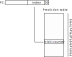
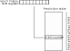

# Assignment 4

Originally from ECS 154B Lab 4, Winter 2019

# Table of Contents

* [Introduction](#introduction)
    * [Pipeline design constraint](#pipeline-design-constraint)
    * [Updating the DINO CPU code](#updating-the-dino-cpu-code)
    * [Goals](#goals)
* [Pipelined CPU design](#pipelined-cpu-design)
    * [Running simulations](#running-simulations)
    * [CPU designs](#cpu-designs)
    * [Understanding the simulator output](#understanding-the-simulator-output)
    * [Side note on your own code](#side-note-on-your-own-code)
* [Part I: Implement local and global branch predictors](#part-i-implement-local-and-global-branch-predictors)
    * [`BaseBranchPredictor` details](#basebranchpredictor-details)
    * [Local history predictor](#local-history-predictor)
        * [Testing the local history predictor](#testing-the-local-history-predictor)
    * [Global history predictor](#global-history-predictor)
        * [Testing the global history predictor](#testing-the-global-history-predictor)
* [Part II: Running experiments](#part-ii-running-experiments)
    * [Single cycle vs. pipelined](#single-cycle-vs-pipelined)
    * [Comparison of branch predictors](#comparison-of-branch-predictors)
    * [Area overhead of branch predictors](#area-overhead-of-branch-predictors)
    * [Extra credit](#extra-credit)
* [Grading](#grading)
* [Submission](#submission)
    * [Code portion](#code-portion)
    * [Written portion](#written-portion)
    * [Academic misconduct reminder](#academic-misconduct-reminder)
* [Hints](#hints)


# Introduction


In the last assignment, you implemented a pipelined RISC-V CPU.
You implemented forwarding to reduce the impact of data hazards, but control hazards still caused significant performance degradation.
At least, that was your assumption.

In this assignment, you will be evaluating the performance of your pipelined design and extending this design with different branch predictor implementations to try to improve its performance.
You will implement a local history predictor and a global history predictor.
Then, you will compare their performance.

## Pipeline design constraint

For this assignment, you must use the template code as a baseline.
If you use your own pipeline as the basis instead of the template code, **you may get the wrong results.**

## Updating the DINO CPU code

The DINO CPU code must be updated before you can run each lab.
You should read up on [how to update your code](../documentation/updating-from-git.md) to get the assignment 4 template from GitHub.

You can check out the tag `lab4-wq19` to get the template code for this lab.

## Goals

- Learn how to implement different branch predictor designs.
- Evaluate different CPU designs.
- Evaluate trade-offs between different designs.

# Pipelined CPU design

Below is an updated design for the DINO CPU pipeline with a branch predictor.
There are three main differences, which are highlighted.

1. The branch adder has been moved to *the decode stage*.
2. There is now a branch predictor in the decode stage.
3. There is one more option on the PC select MUX.

Apologies for the messy diagram.
It's gotten a bit complicated at this point.


Additionally, a few minor differences include:

1. Updates to the hazard detection logic to deal with taken branches in the ID stage. For this, you should modify the hazard detection unit in `src/main/scala/components/hazardbp.scala`.
2. Updates to the `taken` logic in the execute stage.
3. Logic to update the branch predictor.
4. Generally cleaning up of some of the other code in the pipelined CPU.

**BE SURE TO PULL THE LATEST CODE FROM GITHUB!**
If you don't, you may get the wrong results below.
See [Updating the DINO CPU code](#updating-the-dino-cpu-code) above.

## Running simulations

In this assignment, you will be running a number of simulations to measure the performance of your CPU designs.
Some of these simulations may run for hundreds of thousands of cycles.
They may take a few minutes on the lab computers, and possibly longer on your laptops, especially if you are using Vagrant or virtualization.
All of the tests run in less than 30 seconds on my desktop.

To run experiments, you are going to use the `simulate` main function.
The code can be found in [`simulate.scala`](../src/main/scala/simulate.scala).
This main function takes two parameters: the binary to run, and the CPU design to create.

```
sbt:dinocpu> runMain dinocpu.simulate <BINARY-PATH> <CPU-DESIGN>
```

You can find binaries for the six benchmarks in the [`/src/test/resources/c`](../src/test/resources/c) directory.
The source is also included in the subdirectories.

Binaries:
- `median`: performs a 1D three element median filter
- `multiply`: tests the software multiply implementation
- `qsort`: quick sort
- `rsort`: radix sort
- `towers`: simulation of the solution to the [Towers of Hanoi](https://en.wikipedia.org/wiki/Tower_of_Hanoi)
- `vvadd`: vector-vector add

## CPU designs

You will be evaluating five CPU designs: the single cycle from Lab 2, and then the pipelined design from Lab 3 with four different branch predictors.

- `single-cycle`: The single cycle CPU design.
- `pipelined`: The pipelined CPU design.

After the word `pipelined`, you can specify the branch predictor type.
For instance, for "always taken" you would say: `pipelined-bp:always-taken`.

Therefore, you will be running the following CPU types:

- `single-cycle`: The single cycle CPU design.
- `pipelined-bp:always-not-taken`: The pipelined CPU design from lab 3.
- `pipelined-bp:always-taken`: The pipelined CPU design with an always taken branch predictor
- `pipelined-bp:local`: The pipelined CPU design with a local history predictor.
- `pipelined-bp:global`: The pipelined CPU design with a global history predictor.

As an example, below runs the median workload with the always not taken predictor:

```
sbt:dinocpu> runMain dinocpu.simulate src/test/resources/c/median.riscv pipelined-bp:always-not-taken
[warn] Multiple main classes detected.  Run 'show discoveredMainClasses' to see the list
[info] Running dinocpu.simulate src/test/resources/c/median.riscv pipelined-bp:always-not-taken
[info] [0.001] Elaborating design...
[info] [0.805] Done elaborating.
Total FIRRTL Compile Time: 602.0 ms
Total FIRRTL Compile Time: 301.6 ms
file loaded in 0.580568206 seconds, 743 symbols, 635 statements
Running...
Simulated 10000 cycles
CYCLES: 10110
BP correct: 1033. incorrect: 1041
Verification: 12345678
[success] Total time: 3 s, completed Mar 4, 2019 10:04:13 PM
```

## Understanding the simulator output

As shown above, when the simulator ends, it prints some useful statistics.
Specifically, it prints the total number of cycles to run the workload (`CYCLES: 10110`), the number of correct and incorrect branch predictions (`BP correct: 1033. incorrect: 1041`), and that the application verification succeeds (`Verification: 12345678`).
Note: You'll see a nasty warning if the verification doesn't succeed (and fail the tests as described below).

You will use this output to answer a number of questions below.

## Side note on your own code

If you would like to compile your own C code or modify the C code in the benchmarks directory, you need to set up a RISC-V cross compiler and use the Makefile in the `src/test/resources/c` directory.
It's important to use that Makefile, because it links in the correct starting code (`common/crt.S`) and creates the binary in a way that the simulator will understand it (`common/test.ld`).
To build the binaries in `src/test/resources/c` you can use the following command:

```
PATH=$RISCV_TOOLS_HOME/bin/:$PATH make
```

*You do not need to be able to do this for the assignment!*
I am giving you all of the necessary binaries.
I am happy to answer questions if you run into problems using the cross compiler, but questions on the assignment will take precedence.

More information on setting up a cross compiler can be found on the [RISC-V tools repository](https://github.com/riscv/riscv-tools).

# Part I: Implement local and global branch predictors

For this assignment, you will be writing less Chisel code than previous assignments.
Thus, all of the code is in one part.

In this part, you will be modifying the `branchpred.scala` file in `src/main/scala/components`.
(The template code provided already has the required modifications to the CPU design as detailed above.)
You will implement the modules `LocalPredictor` and `GlobalHistoryPredictor`.
The `AlwaysTakenPredictor` and `AlwaysNotTakenPredictor` have been implemented for you.

In this file, there is a `BaseBranchPredictor` which has some convenience functions to allow for a very flexible branch predictor implementation.
Chisel allows for *parameterized* hardware, which, until now, we have not taken advantage of.
`configuration.scala` has parameters for the size of the branch prediction table and the number of bits for the table's saturating counters.
The template code handles all of the parameterized logic for you.
You simply have to use the structures and functions defined in `BaseBranchPredictor`.

## `BaseBranchPredictor` details

The base branch predictor instantiates a set of registers to hold the prediction table (`predictionTable`).
You will use this in your local and global predictors to store the predictions for future branches based on past history.
Here's a few examples on how to use the table.

To get the current value out of the table for a particular index, you can use the following:

```
val index = Wire(UInt(tableIndexBits.W))
val value = predictionTable(index)
```

Note that `tableIndexBits` is the number of bits needed to index the table, `log_2(number of table entries)`.

Additionally, the `BaseBranchPredictor` has two functions to increment and decrement saturating counters.
You can pass a Chisel register to these functions to increment/decrement the value and store it back to the same location.
For instance, if you wanted to decrement a saturating counter in the branch history table and store it back to the same location, you could use the following:

```
decrCounter(predictionTable(index))
```

`incrCounter` will increment a saturating counter.
See the code in `BaseBranchPredictor` for details.

## Local history predictor

For this predictor, you will use the PC of the branch to predict whether the branch is taken or not taken.
The figure below shows the high-level function of the local branch predictor.



You will need to implement two parts.
First, you will implement the prediction such that every cycle given the incoming PC the branch predictor will predict either taken or not taken for that PC.
Second, whenever the `io.update` input is high, you need to update the prediction for the *last* PC that was predicted.
You should update the prediction based on the `io.taken` input (if true, the branch was taken, if false it was not taken).

*Hint on getting the 'last' PC*: the predictor is always updated one cycle after the prediction is made.

### Testing the local history predictor

To test the local history predictor, you can use the following tests:

```
sbt:dinocpu> testOnly dinocpu.LocalPredictorUnitTesterLab4
sbt:dinocpu> testOnly dinocpu.SmallApplicationsLocalTesterLab4
sbt:dinocpu> testOnly dinocpu.LargeApplicationsLocalTesterLab4
```

Updated tests (not on Gradescope) are available if you pull from `jlpteaching/dinocpu` after 10am on 3/13.
This adds three random tests for the local predictor.

## Global history predictor

Instead of using the PC to predict if a branch is taken or not, the global predictor uses the last `N` branches.
For instance, if the last `N` branches were `TNTNTN`, you might predict the next branch would be taken.



Thus, you will need to keep track of the history of the last `N` branches.
Then, you can use this history to index into the prediction table as shown below.

To implement this, you will first implement the history shift register which is updated every time `io.update` is true (since this is when branches are known).
Then, use the history register to make a prediction on every cycle.
Finally, you will use the history register to update a particular entry in the prediction table every time a branch is executed and you know whether it was taken or not (i.e., when `io.update` is true).

### Testing the global history predictor

To test the local history predictor, you can use the following tests:

```
sbt:dinocpu> testOnly dinocpu.GlobalPredictorUnitTesterLab4
sbt:dinocpu> testOnly dinocpu.SmallApplicationsGlobalTesterLab4
sbt:dinocpu> testOnly dinocpu.LargeApplicationsGlobalTesterLab4
```

Updated tests (not on Gradescope) are available if you pull from `jlpteaching/dinocpu` after 10am on 3/13.
This adds two more random tests for the global history predictor.

# Part II: Running experiments

The bulk of this assignment will be running experiments and answering questions.
Once you have correct implementations of the local and global history predictors, you can start trying to decide how to design the best CPU!

The workloads are the six benchmark binaries [mentioned above](#running-simulations).
Make the following assumptions for the questions below:

| CPU Design   | Frequency |
|--------------|-----------|
| Single cycle | 1 GHz     |
| Pipelined    | 3 GHz     |

Feel free to answer questions in prose, as a table, or as a graph.
However, make sure your answers are **legible**!
These questions *will be graded*.
We know the correct answers since everyone is using the same pipeline design.

I strongly suggest using graphs and writing your answers using a word processor.
I suggest you *do not* write your answers by hand.

## Single cycle vs. pipelined

In this part, you will run different CPU designs from Lab 2 and Lab 3 (you can use the template code from this lab!) and compare their performance.

1. For each workload, what is the total number of instructions executed?
2. For each workload, what is the CPI for the pipelined CPU with an *always not taken* branch predictor?
3. Given the frequency assumptions above, what is the speedup of the pipelined design with the always not taken branch predictor over the single cycle design for each workload?

## Comparison of branch predictors

In this part, you will run the benchmarks with the new branch predictors you designed, compare their performance, and explain why you see that performance.

4. For each workload, what is the best performing branch predictor?
5. What is the speedup of the best performing branch predictor compared to *always not taken* for each workload?
6. Compare the workloads for which the global history predictor does better than the local history predictor. Look at the C code given in the `src/test/resources/c/` directory. Explain why the global history predictor does better than the local history predictor for one of these workloads.

## Area overhead of branch predictors

In this section, you will compare the performance and cost of different branch predictor designs.
You are trying to maximize the area-performance trade-off.
You can modify the size of the branch prediction table by changing the variables `saturatingCounterBits` and `branchPredTableEntries` in `src/main/scala/configuration.scala` (lines 22 and 24).

Assume the following.
Note: these are made-up numbers.
Don't use this in your research or job in industry.

| Design              | Area     |
|---------------------|----------|
| No branch predictor | 1 mm^2   |
| 1 Kilobyte of SRAM  | 0.1 mm^2 |

7. What is the size (in bytes, B) of the default branch predictor with 2 bits per saturating counter and 32 entries?
8. For each workload, what is the performance improvement if you increase the size of the branch predictor to 256 entries for the local predictor?
9. For each workload, what is the performance improvement if you keep the number of predictor entries at 32 and increase the saturating counter bits to 3 for the local predictor? What about increasing the saturating counter bits to 8? Explain why you see a speedup for 3 bits and a slowdown for 8 bits **for qsort**.
10. At a high level (e.g., you don't have to show the data), compare the percent area overhead of the previous designs (with 256 entries and 2-bit counters, with 32 entries and 3-bit counters, and with 32 entries and 8-bit counters) to the performance improvement over the baseline design with 32 entires and 2-bit counters. Do you believe the increased area is worth it? Be sure to talk about the characteristics of the benchmark code in your answer.

## Extra credit

11. Design a new branch predictor that does better than the others for some workload. Explain your design and why it does better. *Hint: Google has many branch predictor suggestions. Make sure to mention where you took your design from, if you didn't create it yourself.*

# Grading

Grading will be done automatically on Gradescope.
See [the Submission section](#Submission) for more information on how to submit to Gradescope.

| Name         | Percentage |
|--------------|------------|
| Part I       | 20%        |
| Part II      | 80%        |
| Extra credit | +10%       |

# Submission

**Warning**: read the submission instructions carefully.
Failure to adhere to the instructions will result in a loss of points.

## Code portion

You will upload the one file that you changed (`branchpred.scala`) to Gradescope on the [Assignment 4: Code]() assignment.

Once uploaded, Gradescope will automatically download and run your code.
This should take less than 5 minutes.
For each part of the assignment, you will receive a grade.
If all of your tests are passing locally, they should also pass on Gradescope unless you made changes to the I/O, **which you are not allowed to do**.

Note: There is no partial credit on Gradescope.
Each part is all or nothing.
Either the test passes or it fails.

## Written portion

You will upload your answers for the [Assignment 4: Written]() assignment to Gradescope.
**Please upload a separate page for each answer!**
Additionally, I believe Gradescope allows you to circle the area with your final answer.
Make sure to do this!

We will not grade any questions for which we cannot read.
Be sure to check your submission to make sure it's legible, right-side-up, etc.

## Academic misconduct reminder

You are to work on this project **individually**.
You may discuss *high level concepts* with one another (e.g., talking about the diagram), but all work must be completed on your own.

**Remember, DO NOT POST YOUR CODE PUBLICLY ON GITHUB!**
Any code found on GitHub that is not the base template you are given will be reported to SJA.
If you want to sidestep this problem entirely, don't create a public fork and instead create a private repository to store your work.
GitHub now allows everybody to create unlimited private repositories for up to three collaborators, and you shouldn't have *any* collaborators for your code in this class.

# Hints

- Start early! There is a steep learning curve for Chisel, so start early and ask questions on Piazza and in discussion.
- If you need help, come to office hours for the TAs, or post your questions on Piazza.
- See [common errors](../documentation/common-errors.md) for some common errors and their solutions.
