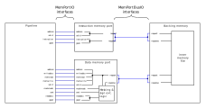

# Modular memory

The design of the DINO CPU modular memory system encourages abstraction of memory functionality into distinct memory components in a robust, flexible manner.

## Basic components

The modular memory system utilizes a 'pipeline', 'memory ports', and a 'backing memory':

##### Pipeline
The pipeline is simply the CPU model issuing memory operations. From the perspective of the pipeline, the memory is composed of `MemPortIO` interfaces only, 

##### Memory ports
Memory ports are smart modules which transform incoming pipeline signals in a `MemPortIO` into a `Request`. Likewise, it receives `Response`s from the backing memory and pre-processes the response data to result in a typical `readdata` output.

The memory ports abstract the gap between the pipeline and the backing memory in a way that permits flexibility: while a port is fundamentally responsible for exchanging information between the pipeline and the backing memory, the method by which it does this can vary with specialized implementations of memory ports like caches.

##### Backing memory
The backing memory is a module which wraps the inner `Mem` object and performs writes or reads to the inner memory depending on the request it receives.

Like the memory ports, the backing memory abstraction permits specialized implementations which handle memory requests immediately before executing them. For example, latency is achieved in the non-combinational memories by inserting all `Request`s into a `Pipe` before they are processed.

Backing memories see the ports and pipeline as being composed only of `MemPortBusIO` interfaces.

## Stable interfaces
Each component connects to each other using two interfaces: `MemPortIO` and `MemPortBusIO`. 

These memory interfaces are stable between all CPU models, so all memory components should communicate using these 
interfaces _only_. 

##### MemPortIO
`MemPortIO` is the primary abstract interface for memory ports. As such, it has IO corresponding with the signals a port receives from the pipeline, and a `Flipped[MemPortBusIO]` which connects to a backing memory.

Inputs: 
- address: The address of the location in memory
- valid:   High when the pipeline is actively requesting a memory operation

Outputs:
- good:    High when the backing memory is idling and ready for another operation; relevant for latent memories

Amongst the base memory port IO, `IMemPortIO` and `DMemPortIO` implement this interface with additional signals for instruction ports and data ports, respectively.

##### MemPortBusIO

`MemPortBusIO` is the primary interface of the backing memory. For every port that connects to the backing memory, it contains a distinct `MemPortBusIO` for that port to connect to.
This interface contains two channels for a `Request` and `Response` to pass through, where requests originate from the memory ports and responses from the backing memory.

## Dual ported memory
The DINO CPU exclusively uses a dual ported memory system, where a instruction port and data port both interface 
with the backing memory to request two memory accesses at once. So a specialized implementation of a port
must include a `BaseIMemPort` subclass and `BaseDMemPort` subclass. 

The following diagram depicts how the pipeline would inteface with the instruction and data ports, as well as how the ports and backing memory connect together:

## Memory configuration

Configuring the CPU to use different modules can be done by modifying the `memPortType` and `memType` paremeters
in `configuration.scala`. 

So far, the following configurations exist for these two parameters: 

*Memory ports:*

- `combinational-ports`: CPU will use `ICombinMemPort` and `DCombinMemPort`, which are designed to execute memory reads combinationally and memory writes sequentially in exactly 1 cycle.
- `non-combinational-ports`: The CPU will use `INonCombinMemPort` and `DNonCombinMemPort`, which issue sequential memory reads and writes to non-combinational memory.

*Memories:*

- `combinational`: CPU will use a `DualPortedCombinMemory`, which supports combinational reads and 1 cycle sequential writes.
- `non-combinational`: CPU will use a `DualPortedNonCombinMemory`, which supports sequential reads and sequential writes. This memory is further parameterized with the `memLatency` variable, sp11ecifying this memory's latency in number of cycles.

Certain memory configurations require specific memory ports. For example, the combinational memory is designed to be used with combinational ports, while the non-combinational memory expects non-combinational ports or caches. 

Mixing these configurations - combinational ports with non-combinational memory, non-combinational ports with combinational memory, or any other invalid configuration - will likely result in elaboration or execution errors.

## Creating extension modules
Before designing an additional module that extends the memory system with new functionality, it is important to determine which module you need to extend for the simplest implementation.

In general: 
- Use a **memory port implementation**: if you need to pre-process memory operations before actually executing them. 
    - Caches are one example of a port implementation: they issue memory requests on cache misses only, and otherwise they withhold the memory request to look in their internal SRAM memory.
- Use a **backing memory implementation**: if you need the memory itself to have some necessary feature or property. 
    - Non-combinational memory falls under this category; incoming memory requests are delayed to simulate memory latency.

Likewise, use `MemPortIO` and `MemPortBusIO` to ensure that your components can talk with existing memory components.

CPU models do not need to be designed with specific memory implementations in mind, except for the fact that they should proceed with execution when they receive high on the `good` output of a port. That is, if either `imem.good` or `dmem.good` are low, then the CPU should stall.
